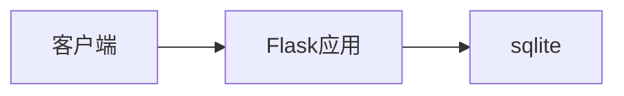

# Blog Backend

基于 Flask 的 RESTful API 服务，提供blog应用的数据存储和业务逻辑处理。

## 核心架构


## 已完成接口
| 模块       | 端点示例                  | 方法   | 描述                     |
|------------|---------------------------|--------|--------------------------|
| 用户认证   | `/auth/login`             | POST   | JWT 令牌签发             |
| 文章管理   | `/articles/{id}/comments` | GET    | 获取文章评论列表         |
| 文件上传   | `/upload/image`           | POST   | 头像/封面图上传          |

目前已实现的功能模块包含用户auth、文章article和评论comment。

## 部署指南
```bash
git clone https://github.com/Jack-samu/the-blog-backend.git

cd the-blog-backend
# 依赖安装
pip install -r requirements.txt -i https://pypi.tuna.tsinghua.edu.cn/simple

# 数据库初始化
flask db init
flask db migrate
flask db upgrade

# 开发model
flask run --host=0.0.0.0 --port=8088 --debug
```
