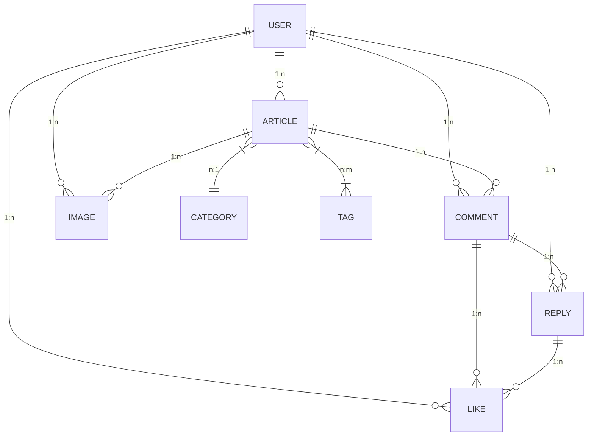

# Blog Backend

基于 Flask 的 RESTful API 服务，提供blog应用的数据存储和业务逻辑处理。

## 核心架构


## 现有数据结构


## 已完成接口
| 模块       | 端点示例                  | 方法   | 描述                     |
|------------|---------------------------|--------|--------------------------|
| 用户认证   | `/auth/login`             | POST   | JWT 令牌签发             |
| 文章管理   | `/articles/{id}/comments` | GET    | 获取文章评论列表         |
| 文件上传   | `/upload/image`           | POST   | 头像/封面图上传          |

目前已实现的功能模块包含用户auth、文章article和评论comment。

## 部署指南
```bash
git clone https://github.com/Jack-samu/the-blog-backend.git

cd the-blog-backend
# 依赖安装
pip install -r requirements.txt -i https://pypi.tuna.tsinghua.edu.cn/simple

# 事先创建对应文件夹
sudo mkdir /opt/service
sudo mkdir /opt/service/mysql
sudo mkdir /opt/service/mysql/conf /opt/service/mysql/logs /opt/service/mysql/data

# 假定已经按照配置可用docker
sudo docker run -d --restart=unless-stopped \
  -p 3306:3306 \
  -p 33060:33060 \
  -v /opt/service/mysql/conf:/etc/mysql/conf.d \
  -v /opt/service/mysql/logs:/var/log/mysql \
  -v /opt/service/mysql/data:/var/lib/mysql \
  -v $(pwd)/init.sql:/docker-entrypoint-initdb.d/init.sql \
  --name mysql_service \
  -e MYSQL_ROOT_PASSWORD=123456 \
  -e MYSQL_DATABASE=course \
  -e MYSQL_USER=guest \
  -e MYSQL_PASSWORD=Guest123@ \
  mysql:8.0 \
  --character-set-server=utf8mb4 \
  --collation-server=utf8mb4_unicode_ci \
  --default-authentication-plugin=mysql_native_password
```

各种密钥都是在自定义.env中，只消配上对应邮箱配置和数据库配置即可，不多。

```bash
# 数据库初始化
flask db init
flask db migrate
flask db upgrade

flask run --port=8088 --debug
```
