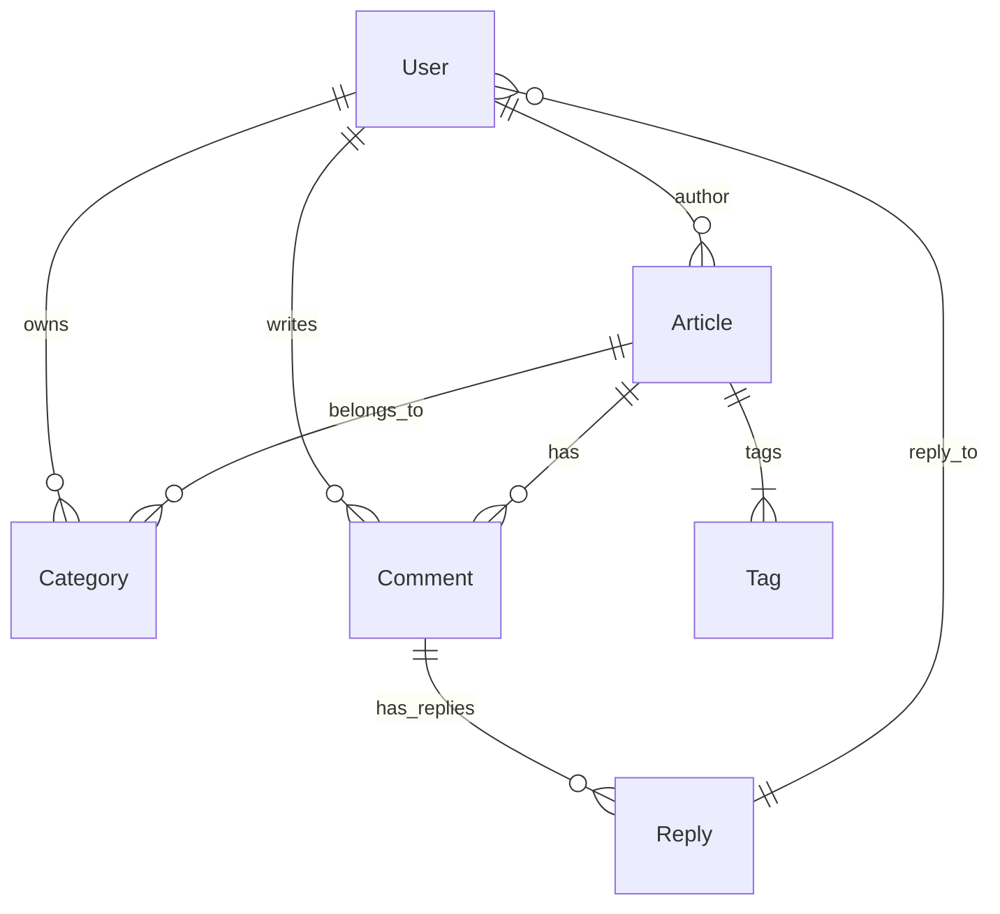
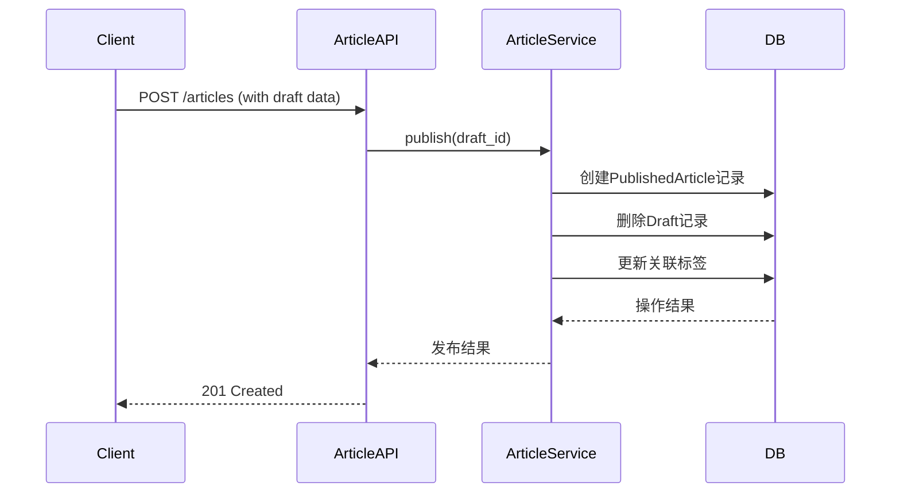
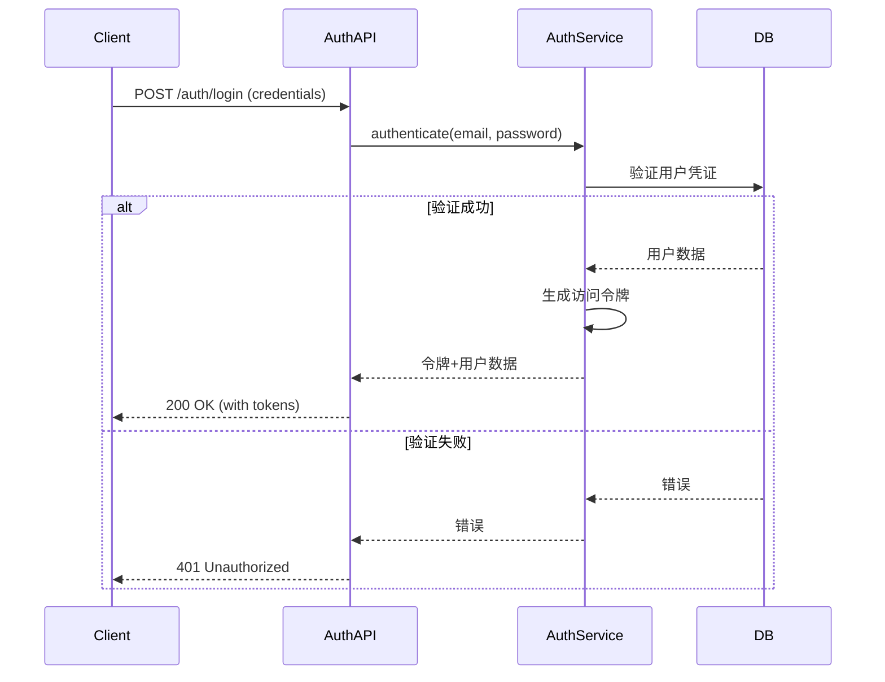

# Flask 博客后台系统架构文档

## 系统概述

基于 Flask 的 RESTful API 服务，为博客应用提供完整的数据存储和业务逻辑处理能力，支持文章管理、用户认证、评论互动等核心功能。

## 架构设计

### 分层架构

| 层级 | 模块 | 职责 | 关键组件 |
|------|------|------|----------|
| **表示层** | 路由蓝图 | 接收HTTP请求，返回JSON响应 | AuthBlueprint, ArticleBlueprint, CommentBlueprint |
| **服务层** | 业务服务 | 处理核心业务逻辑 | ArticleService |
| **数据层** | 数据模型 | 数据持久化与访问 | Article, User, Comment, Tag, Category |
| **核心模块** | 基础组件 | 提供系统基础能力 | Config, Extensions, Hooks |

### 核心模块说明

#### 1. 配置管理 (`config.py`)
- 多环境支持：开发/测试/生产环境独立配置
- 敏感信息通过环境变量加载
- 数据库连接、JWT密钥、邮件服务等全局配置

#### 2. 扩展集成 (`extensions.py`)
- 统一管理第三方扩展初始化：
  - Flask-SQLAlchemy (数据库ORM)
  - Flask-Migrate (数据库迁移)
  - Flask-Cors (跨域请求)

#### 3. 请求拦截 (`hooks.py`)
- 认证拦截器：JWT令牌验证(todo but accomplish in another way)
- 请求日志记录
- 异常统一处理(todo)
- 命令自定义

#### 4. 数据库事件 (`events.py`)
- 图片清理
- 栏目和标签清理

## 数据模型设计



## 关键业务流程

### 文章发布流程


### 认证流程


## 部署指南

### 本地配置
**1. 仓库clone**
```bash
git clone https://github.com/Jack-samu/the-blog-backend.git
cd the-blog-backend
```

**2. 安装依赖和配置mysql的docker服务**
```shell
# 安装虚拟环境依赖且初始化后安装项目依赖
sudo pip3 install pipenv
pipenv install
pip install -r requirements.txt -i https://pypi.tuna.tsinghua.edu.cn/simple

# mysql容器服务配置
sudo docker run -d --restart=unless-stopped \
  -p 3306:3306 \
  -v $(pwd)/db/init.sql:/docker-entrypoint-initdb.d/init.sql \
  --name mysql_service \
  -e MYSQL_ROOT_PASSWORD=123456 \
  -e TZ=Asia/Shanghai \
  mysql:8.0 \
  --character-set-server=utf8mb4 \
  --collation-server=utf8mb4_unicode_ci \
  --default-authentication-plugin=mysql_native_password
```

**3. 准备.env本地配置文件**
编辑一份如下的`.env`配置文件
```
# 数据库部分
MYSQL_ROOT_PWD='111111'
MYSQL_USER='your_user'
MYSQL_PWD='your_user_pwd'
MYSQL_HOST='your_mysql_host'
MYSQL_PORT=your_mysql_port
MYSQL_DATABASE='your_mysql_database'

# 邮箱部分
MAIL_SERVER='your_mail_server'
MAIL_USERNAME='your_mail_user'
MAIL_PASSWORD='your_smtp_pwd'
MAIL_PORT=your_smtp_port
```

**4. 执行启动脚本**
```shell
chmod +x start.sh
./start.sh
```

### docker部署
```shell
# 拉起服务
docker compose up -d --build

# 关闭
docker compose down

# 关闭服务并且清理本地镜像
docker compose down --rmi local

# 后台服务检查
curl http://localhost:8088/articles
```

### 引入监控
**1. 子仓引入**
```shell
git clone https://github.com/Jack-samu/the-blog-backend.git
cd the-blog-backend

# 初始化并更新子module
git submodule init
git submodule update

# 直接拉取也可以
git clone --recursive https://github.com/Jack-samu/the-blog-backend.git
```

[>>>细节请查看子仓说明](https://github.com/Jack-samu/flask-monitoring-kit)

### 添加prometheus监控

## 系统特性

1. **完善的认证体系**
   - JWT令牌认证
   - 令牌自动刷新
   - 权限分级控制

2. **内容管理能力**
   - 草稿/发布双状态管理
   - 分类与标签系统

## 架构演进路线

1. **短期优化**
   - 增加Redis缓存层
   - 实现API限流机制
   - 完善监控指标

2. **中期规划**
   - 引入Celery异步任务队列
   - 支持多用户架构
   - 增加全文搜索功能

3. **长期愿景**
   - 微服务化拆分
   - 实现Serverless部署
   - 支持国际化和多语言
